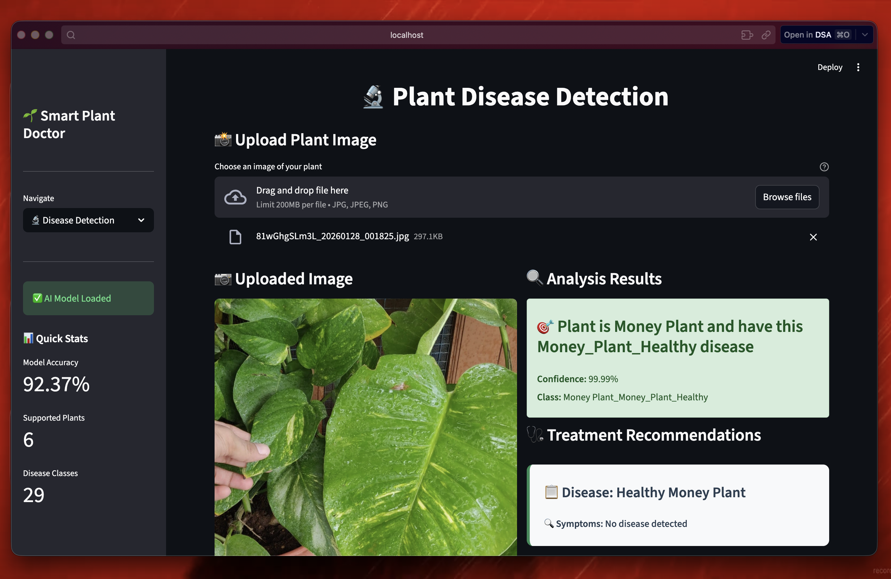
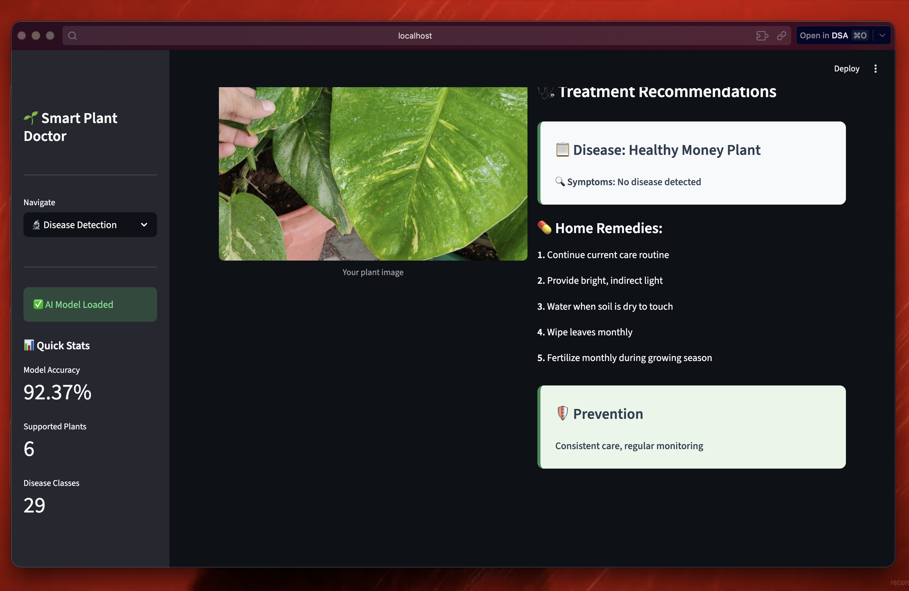

# Smart Plant Doctor

Smart Plant Doctor is an AI + IoT plant health platform that combines:

- realtime environmental sensing from ESP32 (temperature, humidity, light, soil moisture), and
- image-based disease detection using a trained deep learning model.

The project delivers live dashboard monitoring and disease diagnosis with treatment/prevention suggestions.

## Highlights

- Realtime dashboard with auto-refresh
- Sensor ingest pipeline (ESP32 -> FastAPI -> SQLite -> Streamlit)
- Plant disease classifier with 29 classes
- Treatment and prevention text for detected diseases
- Plant-specific status metrics including Wet/Moist/Dry soil condition

## Screenshots





## Project Architecture

```text
ESP32 Sensors
	-> HTTP POST /ingest
	-> FastAPI (ingest.py)
	-> SQLite (data/sensors.db)
	-> Streamlit (app.py)

Uploaded leaf image
	-> ai/inference.py (SmartPlantDoctor)
	-> Predicted class + confidence
	-> Treatment recommendations in UI
```

## AI Model (Plant Disease Detection)

### Model used

- Backbone: MobileNetV2 (PyTorch)
- Inference model class: `SmartPlantDoctor` in `ai/inference.py`
- Input size: 224 x 224
- Output: 29 plant disease/healthy classes

### Classifier head used for inference

The deployed model reconstructs MobileNetV2 and uses this custom classifier head:

- Dropout(0.2)
- Linear(last_channel -> 512)
- ReLU
- Dropout(0.2)
- Linear(512 -> num_classes)

### Training pipeline

Training code is in `ai/src/models/train.py` and data loader in `ai/src/data/dataset.py`.

- Base model: pretrained MobileNetV2
- Train/validation split: 80/20 random split
- Loss: CrossEntropyLoss
- Optimizer: Adam (default lr = 1e-4)
- Image normalization:
	- mean: [0.485, 0.456, 0.406]
	- std: [0.229, 0.224, 0.225]

### Exported model artifacts

- `ai/exports/smart_plant_doctor_model.pth`
- `ai/exports/class_mapping.json`

### Reported performance

- Validation accuracy reported in project: 92.37%

## Supported Plants and Classes

Plants covered in this project include:

- Aloe Vera
- Chrysanthemum
- Hibiscus
- Money Plant
- Rose
- Turmeric

Total classes: 29 (healthy + disease categories).

## Setup

### 1) Create environment and install dependencies

```bash
python3 -m venv .venv
source .venv/bin/activate
pip install -r requirements.txt
```

### 2) Verify model files

```bash
ls ai/exports/smart_plant_doctor_model.pth ai/exports/class_mapping.json
```

## Run (Web App + Ingest)

Use two terminals from repository root.

### Terminal A: start ingest API

```bash
source .venv/bin/activate
export INGEST_TOKEN=changeme
uvicorn ingest:app --host 0.0.0.0 --port 8000
```

### Terminal B: start Streamlit dashboard

```bash
source .venv/bin/activate
streamlit run app.py --server.port 8502
```

Open: `http://localhost:8502`

## ESP32 Realtime Sensor Integration

Firmware is in `sensors data/src/main.cpp`.

Set these values before upload:

- Wi-Fi SSID/password
- `ingestUrl` (your laptop LAN IP + `/ingest`)
- `ingestToken` (must match `INGEST_TOKEN`)
- `plantName` (appears in dashboard dropdown)

Example:

```cpp
const char* ingestUrl = "http://<YOUR-LAPTOP-LAN-IP>:8000/ingest";
const char* ingestToken = "changeme";
```

### Upload commands (PlatformIO)

```bash
cd "sensors data"
pio run -t upload
pio device monitor -b 115200
```

If `pio` is not installed:

```bash
python3 -m pip install -U platformio
```

## Data Flow Notes

- ESP32 posts JSON readings to FastAPI `/ingest`.
- FastAPI writes rows into `data/sensors.db` table `readings`.
- Dashboard queries latest and historical rows from SQLite.
- Auto-refresh updates the UI every few seconds.

## Useful Debug Commands

Check latest sensor rows:

```bash
sqlite3 data/sensors.db "select rowid, datetime(ts,'unixepoch'), plant, temperature, humidity, light, soil_moisture, ph from readings order by rowid desc limit 10;"
```

Check ingest endpoint:

```bash
curl -X POST http://127.0.0.1:8000/ingest \
	-H "Authorization: Bearer changeme" \
	-H "Content-Type: application/json" \
	-d '{"ts":1710000000,"plant":"Money Plant","temperature":30.0,"humidity":45.0,"light":500.0,"soil_moisture":35.0,"ph":6.5}'
```

## Tech Stack

- Python, Streamlit, FastAPI, SQLite
- PyTorch + Torchvision
- Plotly, Pandas, NumPy
- ESP32 (Arduino framework, PlatformIO)

## Repository Notes

- `app.py`: Streamlit UI
- `ingest.py`: sensor ingest API
- `ai/inference.py`: disease inference logic
- `sensors data/src/main.cpp`: ESP32 firmware

## License

MIT (add `LICENSE` file in repo if you want explicit publishing metadata).
